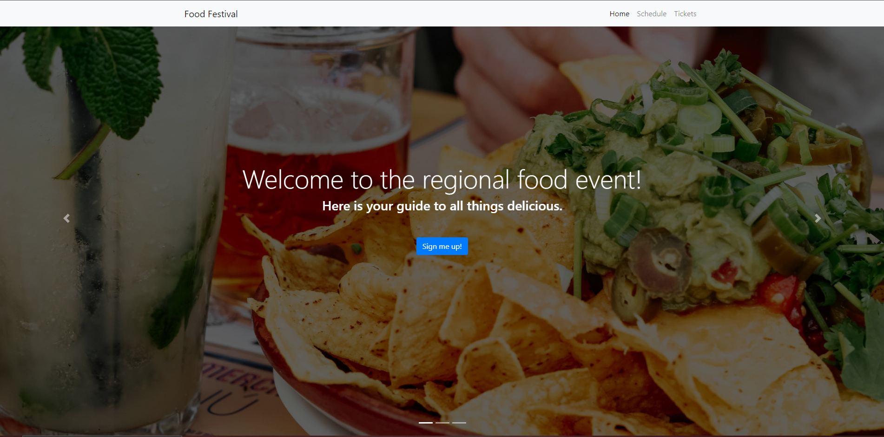
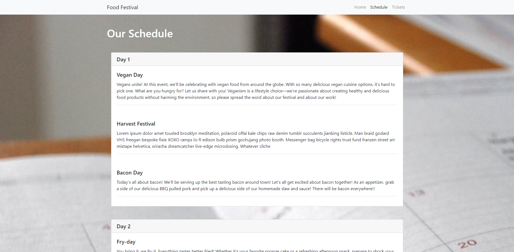
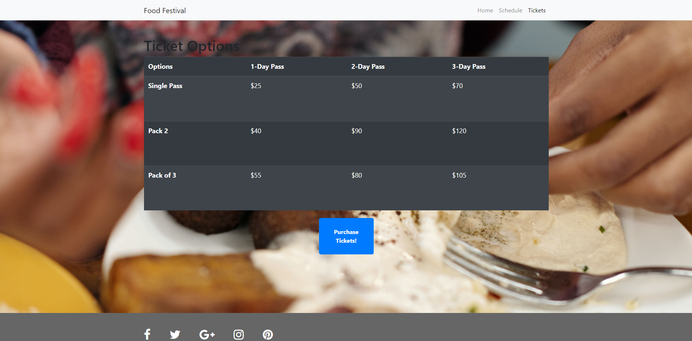

 </a>

<h3 align="center">Food Festival</h3>

---

## 

- [About](#about)
- [Installing](#installing)
- [Usage](#usage)
- [Built With](#built_using)
- [Authors](#authors)
- [Questions](#questions)
- [Screenshots](#screenshots)

## 

Food Festival is a class module designed to teach Progressive web applications (PWA).

## 

1. Clone repository
2. Run `npm install`
3. Run `npm run start:dev`
4. Navigate to localHost:9000

## 

Once you have navigated to the website click on the install icon in the address bar. This will install Food Festival as an app on your desktop. Then you can go offline and test the app for offline capabilities.

## 

- Node.js
- HTML
- CSS
- Webpack

## 

[glenluersman](https://github.com/glenluersman)

## 

- Feel free to open an issue or contact me directly at glen.luersman@gmail.com if you have any questions about the repo. You can find more of my work at [glenluersman](https://github.com/glenluersman/).

## 

</a>

</a>

</a>
